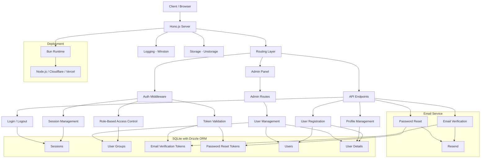

# Auth System

A modern user authentication system built with Hono.js, Drizzle ORM, and SQLite.

## ✨ Features

- 🔐 User registration, login, logout
- 📧 Email verification and password reset
- 👤 User profile management
- 🛡️ Role-based access control
- 📱 Admin panel
- 🔒 Secure session management

## 🚀 Tech Stack

- **Runtime**: Bun
- **Framework**: Hono.js
- **ORM**: Drizzle ORM
- **Database**: SQLite (with LibSQL or Cloudflare D1 support)
- **Templating**: JSX/TSX
- **Styling**: Tailwind CSS
- **Email Service**: Resend
- **Logging**: Winston (with daily rotation for non-Cloudflare environments)
- **Storage**: Unstorage for key-value persistence

## 🏗️ Architecture



## 📝 Routes

- `/` - Homepage with login and registration links
- `/account/login` - User login with optional Turnstile verification
- `/account/register` - User registration with username and password
- `/account/setting` - User profile settings (username, email, nickname, phone)
- `/account/forgot-password` - Password reset request form
- `/account/reset-password` - Password reset with token validation
- `/account/verify-email` - Email verification with token validation
- `/account/logout` - Secure logout with session cleanup
- `/admin/login` - Admin login with token-based authentication
- `/admin` - Admin panel (requires authentication)
- `/install` - Database seeding endpoint for initial setup

## 🗄️ Database Schema

The system uses the following SQLite tables managed by Drizzle ORM:

- **`users`**: Stores core user data (username, email, password hash, user group)
- **`user_groups`**: Defines roles (e.g., admin, user) with display names and descriptions
- **`user_details`**: Extended user information (nickname, phone)
- **`sessions`**: Manages user sessions with expiration and soft deletion
- **`email_verification_tokens`**: Stores tokens for email verification (24-hour expiry)
- **`password_reset_tokens`**: Stores tokens for password resets (1-hour expiry)
- **`two_factor_tokens`**: Supports two-factor authentication (not fully implemented)

All tables include `created_at`, `updated_at`, and `is_deleted` fields for tracking and soft deletion.

## 🛠️ Quick Start

1. **Install dependencies**
   ```bash
   bun install
   ```

2. **Configure environment**
   ```bash
   cp .env.example .env
   ```

3. **Setup database**
   ```bash
   bun run db:gen
   bun run db:push
   ```

4. **Start server**
   ```bash
   bun run dev

   # first time setup, seed the database
   http://localhost:3000/install
   ```

Visit `http://localhost:3000` to get started.

> first time setup, seed the database
>
> `http://localhost:3000/install`

## 📦 Environment Variables

```env
# IM (Instant Messaging) Configuration
IM_PORT=3000
IM_HOST=0.0.0.0
IM_SERVER_NAME=localhost
IM_MAIL_URL=localhost

ADMIN_TOKEN=your-secure-admin-token

# Configuration
# The runtime preset to use for deployment.
# Options include:
# - 'cloudflare-module': For deploying to Cloudflare worker.
# - 'vercel': For deploying to Vercel.
# - 'node': For using the Node.js runtime.
# - 'node_cluster': For deploying with Node.js in a clustered setup.
# This variable allows you to dynamically select the appropriate runtime environment
# based on your deployment target.
DEPLOY_RUNTIME=node

# LibSQL Configuration
# The URL for connecting to the LibSQL database. Default is a local SQLite file.
LIBSQL_URL=libsql://your-libsql-database-url

# The authentication token for accessing the LibSQL database.
LIBSQL_AUTH_TOKEN=your-libsql-auth-token

# Database Type
# Specify the type of database being used. Choose 'libsql' for LibSQL or 'd1' for Cloudflare D1.
# This determines which credentials and driver will be used in the configuration.
DB_TYPE=libsql

# Email Configuration (Resend)
RESEND_API_KEY=your_resend_api_key
RESEND_FROM_EMAIL=noreply@resend.dev

```

## License

[MIT](./LICENSE) License © 2025-PRESENT [wudi](https://github.com/WuChenDi)
